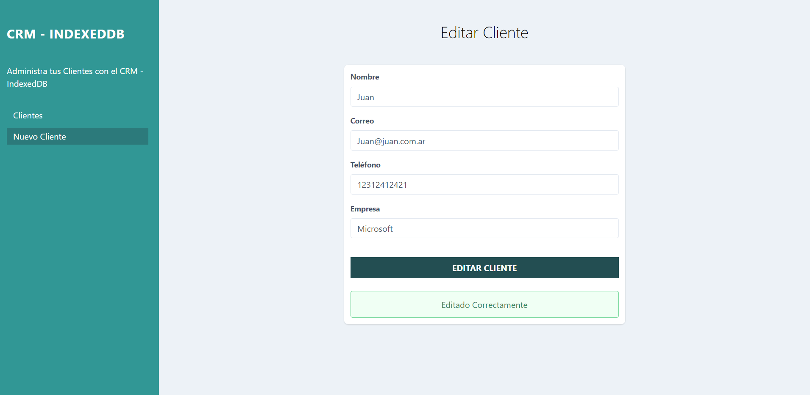

# CRM de clientes con IndexedDB
Este es un CRM (Administración o gestión basada en la relación con los clientes) que utiliza indexedDB como base de datos para la pesistencia de la información de los clientes

## Screenshots
Podemos agregar cuantos clientes sean necesarios 

Y podemos ver el listado completo de todos los clientes

Asi tambien podemos editar la informacion de los clientes

Y finalmente podemos eliminar la información de los clientes donde tendremos una ventana de confimación para eliminar ese cliente

